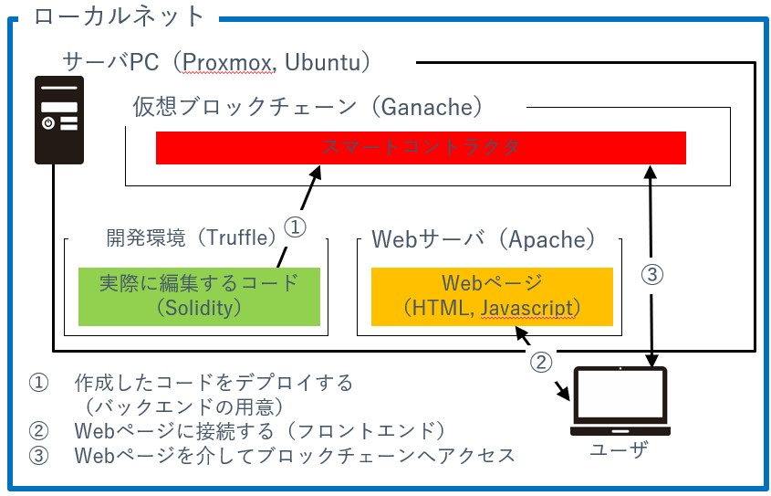
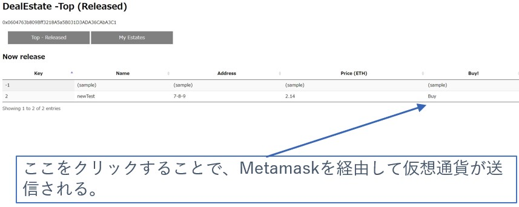
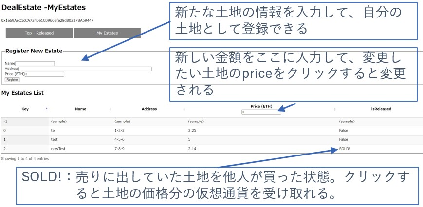

# Deal Estate with Web3

Web3分野への理解、学習を兼ねて、DApp（Decentralized Application、分散型アプリケーション）を制作。  
制作期間：2022/6 ~ 2022/7 （約1か月）  

## 概要
土地の売買をユーザ間で行うためのアプリ  
土地を売りたい人と買いたい人をマッチングするアプリ。  
決算もアプリ内で（仮想通貨）で行われる。  
（登記申請など、本来必要な手続きはとりあえず置いておきます……）

* 売りたい人は自分で値段を決めて公開できる。
* 公開後も売買が成立するまでは値段が変更できる。
* 買いたい人は売りに出ている一覧から探して購入する。
* 購入時に仮想通貨の送金と所有権の変更が行われる。

→ 土地に限らず、基本的な売買機能

## テストした実行環境

```
sudo apt install nodejs  
sudo apt install npm
#プロジェクトdirectoryを作成
sudo npm install -g truffle    #グローバル環境にtruffleをinstall
truffle init

#truffle-config.jsを編集
    module.exports = {
        networks: {
        development: {
            host: "127.0.0.1",     // Localhost (default: none)
            port: 7545,            // Standard Ethereum port (default: none)
            network_id: "*",       // Any network (default: none)
        }
        }
    }

#ganacheを公式サイトからダウンロード、.Appimageを実行
    NEW WORKSPACE->ADD PROJECTでtruffle-config.jsを追加->SAVE WORKSPACE、あとは起動しっぱなし

#contractsの中に.solを置く
truffle compile
truffle create migration 〇〇
    const HelloWorld = artifacts.require("HelloWorld");
    module.exports = function(_deployer) {
        // Use deployer to state migration tasks.
        _deployer.deploy(HelloWorld)
    };
truffle migrate(--reset)
```
クライアントサイド
1. 拡張機能metamask追加
1. importアカウント
1. networkを追加http://127.0.0.1:7545
1. アカウント追加秘密鍵でimport

metamask web3の自動生成がsecurity上の懸念から無くなった、とりあえずLegacyWeb3Extensionを拡張機能からinstall

## デモ画面
index.html 購入可能な土地一覧

myEstate.html 自分の土地一覧、土地登録
